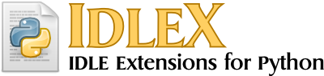

==================================

Version 1.22

IdleX works with Python 3.3+.

See also: http://idlex.sourceforge.net

Installing IdleX
================

This is optional. You may run idlex.py directly without installing.

  python setup.py install --user

Running IdleX
=============

On Windows:
1) Extract the contents of the idlex-x.x.zip file.
2) Double-click "idlex.py" to launch IdleX.
3) Run "scripts/EditWithIdleX.py" if you want 'Edit with IdleX' in the right-click context menu.

On Linux/MacOS:
1) Open a terminal.
2) Change into the idlex directory.
3) Run: `$ python idlex.py`

Demos
=====

The "demos" directory has several .py files that detail the 
functionality of some of these extensions.

Acknowledgements
================

Acknowledgements may be found in idlexlib/ACKS.txt

Adding Extensions to Standard IDLE
==================================

If you want to include an extension in the standard IDLE,
copy the extension to "idlelib" and then modify
idlelib/config-extensions.def to include the contents
of `config_extension_def` found in the extension source code.

